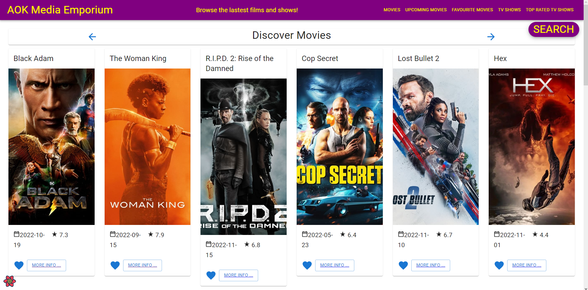
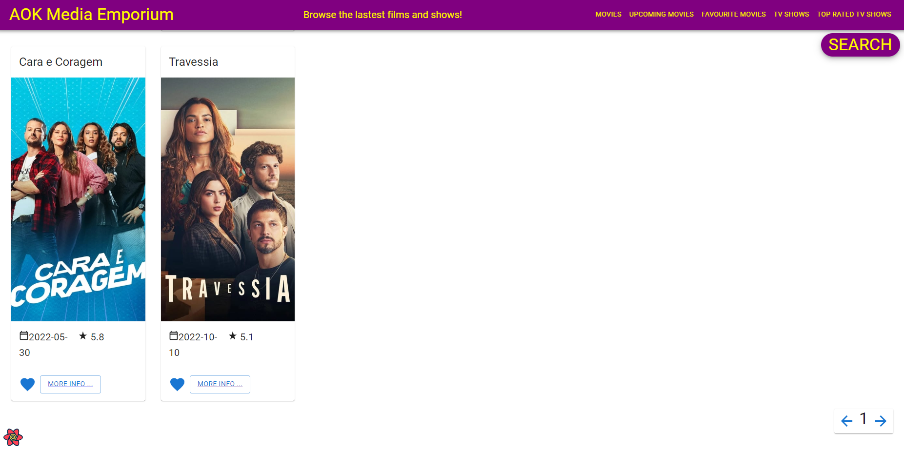
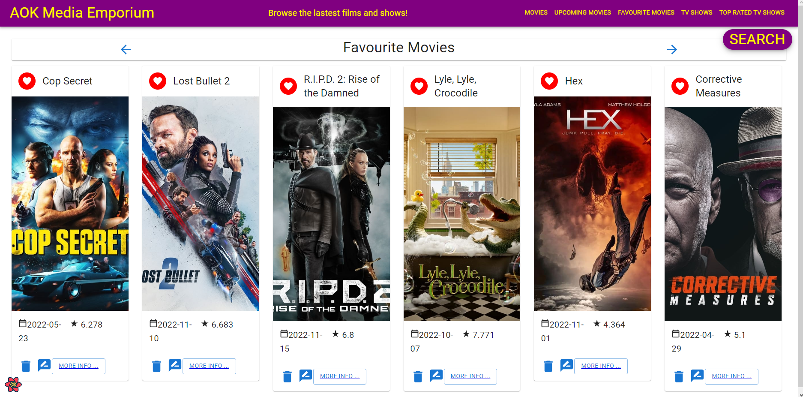
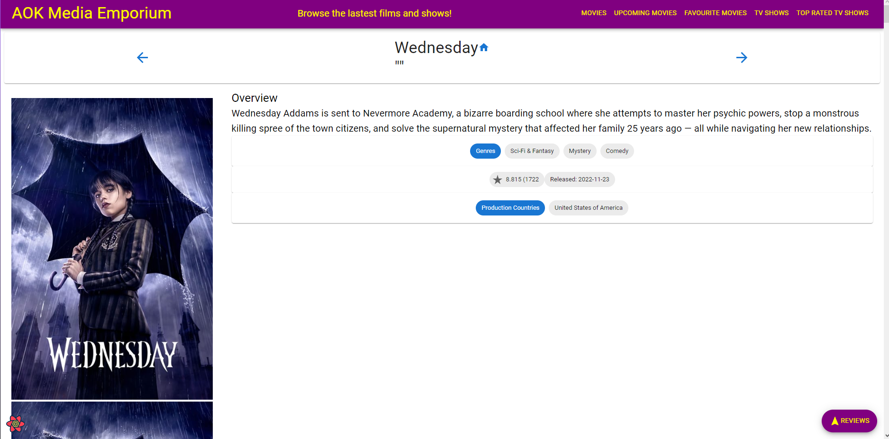
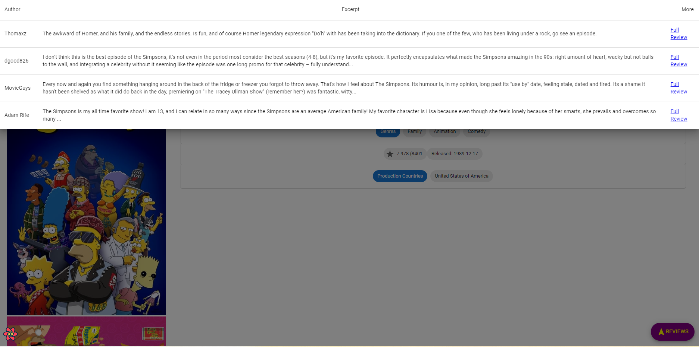
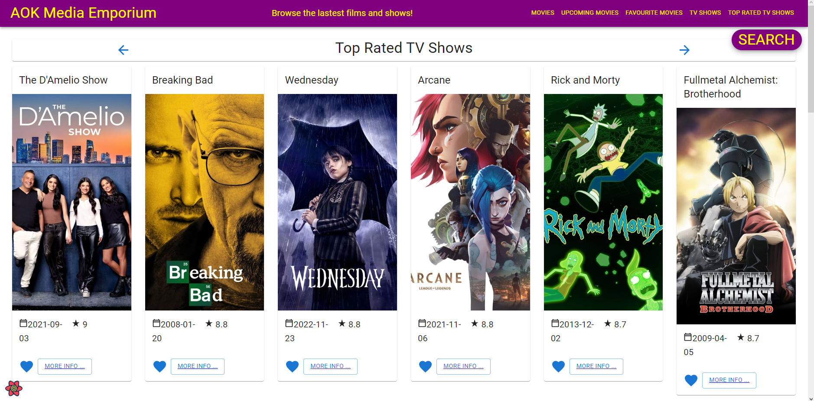
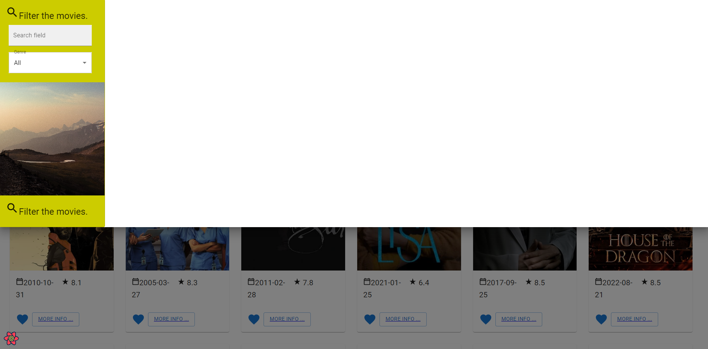
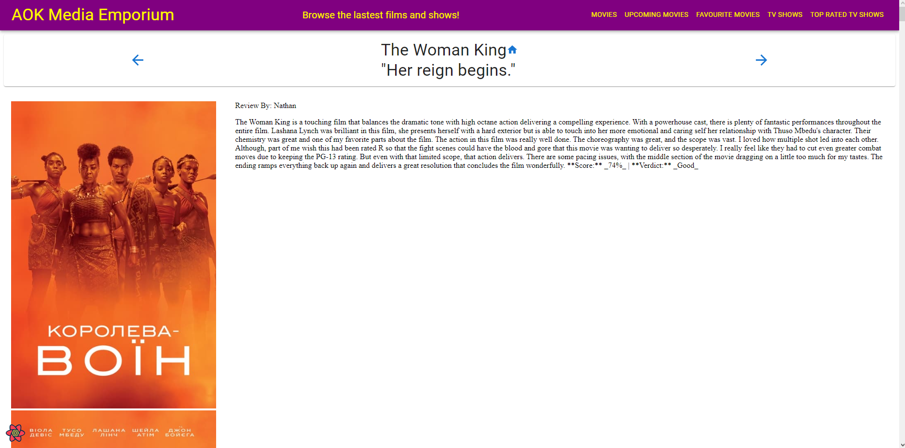
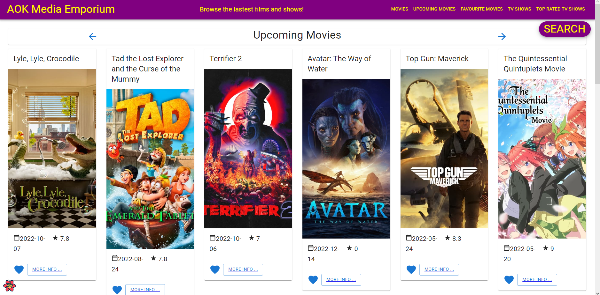

# Web App Dev 2 - Assignment 1 - ReactJS app.

Name: Anthony O'Keeffe

## Overview.

### New Pages.

    + Added TV Shows
    + Added Top rated TV Shows
    + Added TV Shows Details

### New Features.

+ View Tv Shows
+ View the Details of Tv Shows 
+ Browse Different Pages of TV Shows
+ 

## Setup requirements.

Install node packages using "npm install" and then use "npm start".
Aswell as having a properly setup .env file containing "REACT_APP_TMDB_KEY=*your TMDB key*"

## TMDB endpoints.

+ /genre/tv - TV Show Genres
+ /discover/tv - All TV Shows
+ /tv/${id} - TV Show Details
+ /tv/${id}/images - TV Show Images
+ /tv/${id}/reviews - TV Show Reviews
+ /tv/top_rated - Top Rated TV Show

## App Design.

### Component catalogue.

none

### UI Design.

[ Insert screenshots of the __new app pages__ you developed (including modified existing pages), Have an appropriate caption for each one (see example below).

> Lists all Movies + Search Button in top right of screen (Present in all list views)

> Lists all Shows + Pagination at bottom left of screen

> List of Favourite Shows

> The Details of a TV Show including the Overview, Genres, Popularity, Release Date and Production Countrys

> The Review Excerpts you get for shows ehen you press the Reviews Button in the bottom right

> List of Top Rated TV shows

> The Basic Search menu you get when pressing the search Butoon

> The Full Review page for a movie

> List of Upcoming Movies

### Routing.

+ /movies/favourites - List of your favourite movies.
+ /movies/upcoming - A list of upcoming movies. 
+ /shows/pg{pageNumber} - A list of TV Shows by page.
+ /shows/toprated - A list of toprated TV Shows. 
+ /reviews/{reviewid} - Review Details.
+ /movies/{movieid} - Movie Details. 
+ /shows/{showid} - Show Details.

## Independent learning (If relevant).

